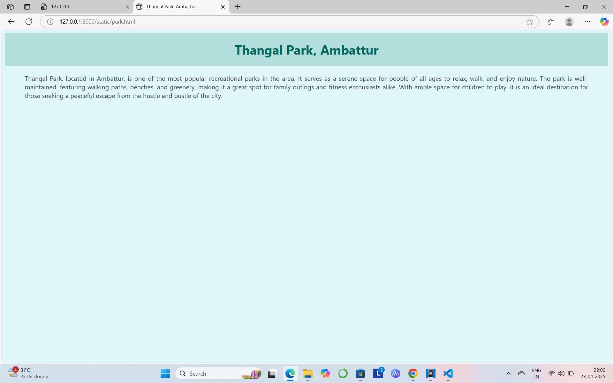

# Ex04 Places Around Me
## Date: 23/04/25

## AIM
To develop a website to display details about the places around my house.

## DESIGN STEPS

### STEP 1
Create a Django admin interface.

### STEP 2
Download your city map from Google.

### STEP 3
Using ```<map>``` tag name the map.

### STEP 4
Create clickable regions in the image using ```<area>``` tag.

### STEP 5
Write HTML programs for all the regions identified.

### STEP 6
Execute the programs and publish them.

## CODE
```
map.html

<html>
<head>
<title>My City</title>
</head>
<body>
<h1 align="center">
<font color="black"><b>Ambattur</b></font>
</h1>
<h3 align="center">
<font color="blue"><b>KISHORE S (212224004278)</b></font>
</h3>
<center>


<map name="image-map">
    <area target="" alt="Pachaiamman Temple" title="Pachaiamman Temple" href="temp.html" coords="584,269,655,324" shape="rect">
    <area target="" alt="Murugappa Polytechnic" title="Murugappa Polytechnic" href="clg.html" coords="261,459,66" shape="circle">
    <area target="" alt="Thangal Park" title="Thangal Park" href="park.html" coords="1304,432,1337,471,1342,534,1276,525,1273,460" shape="poly">
    <area target="" alt="Vcare Hair and Skin Clinic" title="Vcare Hair and Skin Clinic" href="vcare.html" coords="1055,659,63" shape="circle">
    <area target="" alt="Msk Diamond Mahal" title="Msk Diamond Mahal" href="mahal.html" coords="771,338,1074,404" shape="rect">
</map>
</center>
</body>
</html>

clg.html
<!DOCTYPE html>
<html>
<head>
    <title>Murugappa Polytechnic</title>
    <style>
        body {
            background-color: #fff3e0;
            font-family: 'Segoe UI', Tahoma, Geneva, Verdana, sans-serif;
            color: #3e2723;
        }
        h1 {
            text-align: center;
            color: #e65100;
            background-color: #ffe0b2;
            padding: 20px;
            margin: 0;
        }
        p {
            text-align: justify;
            margin: 20px 50px;
            font-size: 22px;
        }
    </style>
</head>
<body>

    <h1>Murugappa Polytechnic</h1>

    <p>Murugappa Polytechnic stands as a hub of technical excellence, offering a wide range of diploma programs tailored to industry needs. With a focus on innovation and practical training, it empowers students to become skilled professionals ready to meet the challenges of a dynamic world.</p>

</body>
</html>

mahal.html

<!DOCTYPE html>
<html>
<head>
    <title>Marriage Mahal</title>
    <style>
        body {
            background-color: #fdf6e3;
            font-family: 'Arial', sans-serif;
            color: #2c3e50;
        }
        h1 {
            text-align: center;
            color: #1a237e;
            background-color: #ffeb3b;
            padding: 20px;
            margin: 0;
        }
        p {
            text-align: justify;
            margin: 20px 50px;
            font-size: 22px;
        }
    </style>
</head>
<body>

    <h1>Marriage Mahal</h1>

    <p>Marriage Mahal is a premier venue offering an exquisite setting for weddings and other special occasions. With its spacious halls, luxurious decor, and top-notch amenities, it ensures that every event is memorable. Whether you're planning an intimate ceremony or a grand celebration, Marriage Mahal provides the perfect environment for your most important day.</p>

</body>
</html>

park.html

<!DOCTYPE html>
<html>
<head>
    <title>Thangal Park, Ambattur</title>
    <style>
        body {
            background-color: #e0f7fa;
            font-family: 'Segoe UI', Tahoma, Geneva, Verdana, sans-serif;
            color: #37474f;
        }
        h1 {
            text-align: center;
            color: #00695c;
            background-color: #b2dfdb;
            padding: 20px;
            margin: 0;
        }
        p {
            text-align: justify;
            margin: 20px 50px;
            font-size: 16px;
        }
    </style>
</head>
<body>

    <h1>Thangal Park, Ambattur</h1>

    <p>Thangal Park, located in Ambattur, is one of the most popular recreational parks in the area. It serves as a serene space for people of all ages to relax, walk, and enjoy nature. The park is well-maintained, featuring walking paths, benches, and greenery, making it a great spot for family outings and fitness enthusiasts alike. With ample space for children to play, it is an ideal destination for those seeking a peaceful escape from the hustle and bustle of the city.</p>

</body>
</html>


temp.html
<!DOCTYPE html>
<html>
<head>
    <title>Pachaiamman Temple, Thirumullaivoyal</title>
    <style>
        body {
            background-color: #fff3e0;
            font-family: 'Segoe UI', Tahoma, Geneva, Verdana, sans-serif;
            color: #5d4037;
        }
        h1 {
            text-align: center;
            color: #bf360c;
            background-color: #ffe0b2;
            padding: 20px;
            margin: 0;
        }
        p {
            text-align: justify;
            margin: 20px 50px;
            font-size: 16px;
        }
    </style>
</head>
<body>

    <h1>Pachaiamman Temple, Thirumullaivoyal</h1>

    <p>Pachaiamman Temple, located in Thirumullaivoyal, Chennai, is an ancient and revered temple dedicated to Goddess Pachaiamman. The temple holds great religious significance for the local community and attracts devotees throughout the year. The temple is known for its peaceful ambiance and historic architecture, featuring intricately designed pillars and a serene environment for worship. Devotees visit the temple to seek blessings for prosperity, well-being, and spiritual growth. It is an important cultural landmark in the region and a place for meditation and prayer.</p>

</body>
</html>

vcare.html

<!DOCTYPE html>
<html>
<head>
    <title>Vcare</title>
    <style>
        body {
            background-color: #e3f2fd;
            font-family: 'Arial', sans-serif;
            color: #263238;
        }
        h1 {
            text-align: center;
            color: #1565c0;
            background-color: #bbdefb;
            padding: 20px;
            margin: 0;
        }
        p {
            text-align: justify;
            margin: 20px 50px;
            font-size: 22px;
        }
    </style>
</head>
<body>

    <h1>Vcare</h1>

    <p>Vcare is a leading service provider in the healthcare industry, committed to delivering top-quality healthcare solutions. We offer a wide range of services, including personalized care, medical consultations, and wellness programs. With a team of dedicated professionals and state-of-the-art facilities, Vcare ensures a holistic approach to health and well-being.</p>

</body>
</html>


```


## OUTPUT





## RESULT
The program for implementing image maps using HTML is executed successfully.
